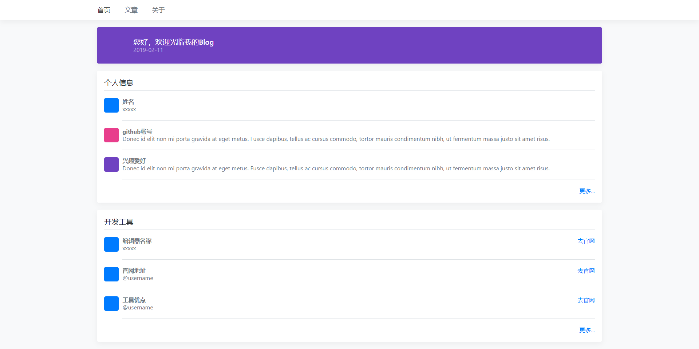

# 第一周第五天
HTML / CSS练习

* [学习CSS布局](http://zh.learnlayout.com/)

### [HTML 实例练习](http://www.runoob.com/html/html-examples.html)
### [CSS 实例练习](http://www.runoob.com/css/css-examples.html)

## 今日任务
* 将1-1.html添加样式，整体样式参考图片，并且顶部的导航在鼠标覆盖时文字颜色变为#007bff
* 在个人目录下新建名称为1-5的目录，将练习的HTML文件或CSS文件保存进去，并提交到github版本库